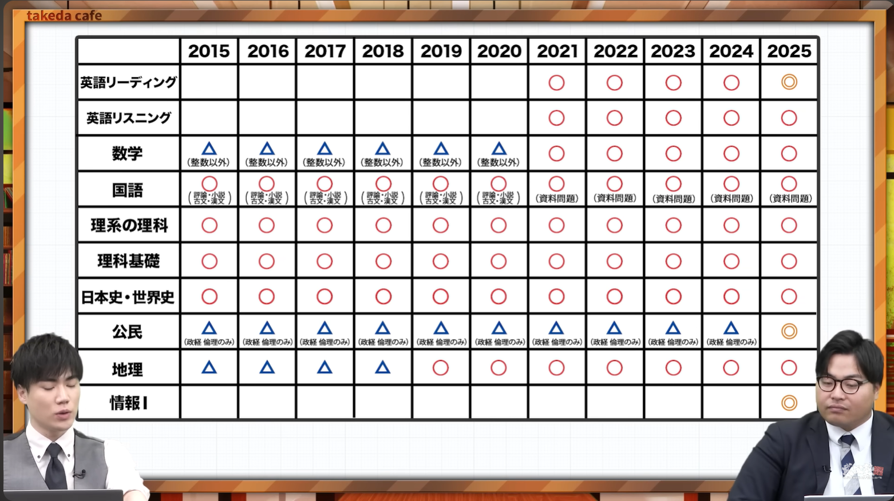
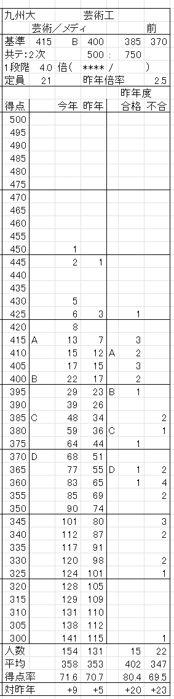

# 今までの人生で一番頑張ってきたんだから、自分にできないことは他の誰にもできない
# ↑難問は誰も解けやしないから秒で捨ててやれ！
# 今年は地獄だぜ～まじ楽しみ
# 解けるやつだけ解こう 無理なもんは無理
# 共通テストで870点取ったうえに二次でも無双して九州大学芸術工学部芸術工学科メディアデザインコースに現役合格した

# テスト終わってから思いつくのはもうそういうもん。
<!---->

隙間時間にすること
<!--1. 化学の公式/定義を教科書でゆっくり丁寧に確認-->
2. 過去に間違えた問題を引っ張り出してきてちょっとずつ復習する。累代演習を惜しまない → 間違えた問題・問題集・付箋を持ち歩く
  1. 地理
  2. 数学
  3. 化学
  4. 物理

## 1/5
### daily
- R
- ~~地理 Z会 1~~
- ~~1A 予想問題集 8~~

### task
- ~~パック 復習~~
- ~~漢文 2025~~
- ~~漢文 2023~~
- ~~化学 2024~2022までの過去問を単元別演習で解いていく~~

## 1/6
### daily
- L
- 2BC 予想問題集 8

### task
- 評論 2025
- 評論 2023
- ~~漢文 2022~~
- ~~化学 前日やったやつを復習~~

## 1/7
### daily
- R
- ~~地理 Z会 2~~
- 1A 予想問題集 9

### task
- 評論 2022
- 小説 2025
- 小説 2023
- 漢文 2021
- 光電効果を習得する
- 物理 2024~2022までの過去問を単元別演習で解いていく

//-------------------------------------
//-------------------------------------

## 1/8 ~ 1/9
- IA 2024 1.5h
- ~~化学 のこり 2h~~
- ~~評論/小説 2025 直し 1h~~
- 物理 単元別演習(2022~2025) 5h
  - ~~小問集合~~
  - ~~力学~~
  - ~~熱力学~~
  - ~~波動~~
  - ~~電磁気~~
  - ~~原子~~
sum = 10h + alpha

## 1/10
- R 2h
- L 1h
- ~~1A 2024 1.5h~~
- 1A 2023 1.5h
- 2BC 8 1.5h

- 評論 2023 2022 1.5h
- 小説 2023 2022 1.5h
- 漢文 2021 1h

### 瞬間最大火力(文系) 3h
  - 地理 地図をみる / 過去に間違えた問題を復習する
  - 国語
    - 評論 間違えた問題を復習
    - 小説 間違えた問題を復習
    - 古文 祈りを捧げる
    - 漢文 手順/間違えた問題を復習
  - R 単語帳を1周 / 始まる前にちょっと読んで予熱する
  - L 始まる前に予熱する

## 1/11 模擬共通テスト1日目
- 瞬間最大火力(文系)
### 模擬内容
- 地理 Z会 4
- R 2024
- L 2021
- 国語 2024
### 瞬間最大火力(理系)
- 1A/2BC 間違えた問題を確認 / そいつらで計算練習
- 物理 公式/現象を確認
- 化学 教科書パラパラ/現象の定義/公式/化学式を再確認/ムキ
- 情報 過去に間違えた問題を確認
- 情報 予想問題集 1~3 パラパラ見てできないやつを確認

## 1/12 模擬共通テスト2日目
- 瞬間最大火力(理系)
### 模擬内容
  - 1A 2022
  - 2BC 9
  - 物理 2021
  - 化学 2021
  - 情報 予想問題集 4
- task
  - 国語

# task(2021は第1日程を優先)
- R 2024
- R 2023
- R 2022
- R 2021
- L 2024
- L 2023
- L 2022
- L 2021
- 1A 2021 1.5h
- 2BC 2023 1.5h
- 2BC 2021 1.5h
- 地理 Z会 3
- 評論 小説 2021
- 国語 2020
- 国語 2019
- 物理 2021
- 化学 2021
- 情報 1
- 情報 2
- 情報 3

- 1A 予想問題集 9 1.5h
- 2BC 予想問題集 8 1h30min
- 2BC 予想問題集 9 1.5h
- 地理 ラーンズ 4
- 地理 ラーンズ 5
- 地理 ラーンズ 6
## 1/12
### daily
- L
- 復習

## 1/13
### daily
- R
### task
- 復習

## 1/14
### daily
- L
### task
- 復習

## 1/15(理系科目)
### daily
- R
### task
- 復習

## 1/16(文系科目)
### daily
- R
- L
### task
- 復習

## 1/17 共通テスト1日目
- しょうみこれまでの模試となんも変わらん
- 何なら東進のが過去の緊張の最高潮やったわ
- 点数より、楽しみながら目の前の問題を時間配分に沿って解くよ～
## 1/18 共通テスト2日目

